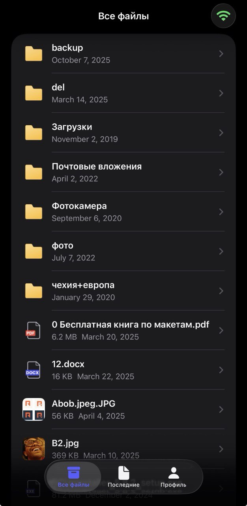

# YADisk: My First iOS Journey 🚀 / Первое iOS приложение

---

## 📸 Preview / Предпросмотр

  

---

## 🇺🇸 English Version

Welcome to **YADisk**, my very first iOS application! This project is a client for Yandex Disk, built using SwiftUI. While it might have some "crooked" solutions and "raw" code, it represents my first big step into the world of iOS development.

### 🧠 Reflections & Learning Journey

This project was a rollercoaster of discovery. Being my first app, I faced many challenges that taught me the basics of:

- **Networking**: Figuring out how to talk to the Yandex Disk API using Alamofire.
- **Persistence**: Implementing a caching system to keep the app working offline.
- **State Management**: Using `@StateObject` and `@EnvironmentObject` to keep data in sync.

> [!NOTE]  
> **Honest Disclaimer**: Since this is a debut project, you might find some unconventional architectural decisions. It's a "living" proof of my growth from zero to a working (mostly!) application.

### ✨ Features

- **🔐 Secure Authentication**: Integrated with `YandexLoginSDK`.
- **📂 File explorer**: Supports folders, files, and navigation.
- **🕒 Recent Files**: A dedicated tab for your latest activity.
- **📶 Network Monitor**: Alerts you when you go offline.
- **💾 Local Cache**: Uses a custom JSON-based caching mechanism.

### 🛠 Tech Stack

- **UI**: SwiftUI
- **Networking**: Alamofire
- **Auth**: YandexLoginSDK

### 🚀 Getting Started

1. `git clone https://github.com/yourusername/yadisk.git`
2. `cd yadisk`
3. `pod install`
4. Open `idk ydisk.xcworkspace`

---

## 🇷🇺 Русская версия

Добро пожаловать в **YADisk** — моё самое первое iOS-приложение! Это клиент для Яндекс Диска, написанный на SwiftUI. Несмотря на некоторые «пробы пера» и сырой код, этот проект стал моим первым большим шагом в мир мобильной разработки.

### 🧠 О проекте и обучении

Этот проект стал настоящим испытанием. Как в самом первом приложении, мне пришлось разбираться с нуля во многих вещах:

- **Сеть**: Понимание того, как общаться с API Яндекс Диска через Alamofire.
- **Кэширование**: Реализация системы сохранения данных, чтобы приложение работало без интернета.
- **Состояние**: Использование `@StateObject` и `@EnvironmentObject` для синхронизации данных.

> [!NOTE]  
> **Честный дисклеймер**: Так как это мой дебютный проект, здесь можно встретить нестандартные архитектурные решения. Это «живое» доказательство моего прогресса от нуля до рабочего приложения.

### ✨ Особенности

- **🔐 Безопасная авторизация**: Интеграция с `YandexLoginSDK`.
- **📂 Файловый менеджер**: Поддержка папок, файлов и навигации по диску.
- **🕒 Последние файлы**: Отдельная вкладка для быстрого доступа к недавним файлам.
- **📶 Мониторинг сети**: Уведомления при потере интернет-соединения.
- **💾 Локальный кэш**: Самописный механизм кэширования на основе JSON.

### 🛠 Стек технологий

- **UI**: SwiftUI
- **Сеть**: Alamofire
- **Авторизация**: YandexLoginSDK

### 🚀 Как запустить

1. `git clone https://github.com/yourusername/yadisk.git`
2. `cd yadisk`
3. `pod install`
4. Откройте `idk ydisk.xcworkspace`

---

_Every expert was once a beginner. This is where I started._
_Каждый эксперт когда-то был новичком. Это моё начало._
